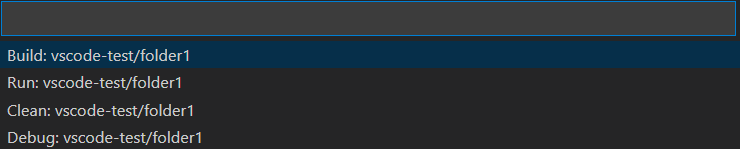

# VSCode C/C++ Runner

🚀 Compile and run your C/C++ code with ease. 🚀

This extension provides tasks to compile, run and debug your C/C++ code.  
It does not only compile single C/C++ files but also multiple files.  
You do not need to know about any compiler and Makefile commands. 😎

## Example

## Software Requirements

- 🔧 Microsoft's C/C++ VSCode Extension (will be installed automatically)
- 🔧 For C: gcc/clang, gdb/lldb and make
- 🔧 For C++: g++/clang++, gdb/lldb and make

## Install the Software Requirements (optional)

- 🖥️ Windows: Recommended to install gcc/g++, gdb and make via [Cygwin](https://www.cygwin.com/). Alternatives to this are [MinGW](http://mingw-w64.org/doku.php) and [MSYS2](https://www.msys2.org/).
- 🖥️ Linux: Recommended to install gcc/g++, gdb and make via a package manager (e.g. `apt` for Debian derivates).
- 🖥️ MacOS: Recommended to install clang/clang++, lldb and make via [xcode-tools](https://developer.apple.com/xcode/features/). An alternative is installing the llvm toolchain with [brew](https://apple.stackexchange.com/a/362837).

## How to use

1️⃣ The first step is to select the folder that contains the C/C++ files you want to compile, run or debug.  
You can select the folder by the quick pick menu from the status bar.  
  
Besides that, you can also select a folder by right-clicking in the context menu.  
2️⃣ The second step is to select either debug or release mode for building the binary.  
  
3️⃣ The third step is to execute the extension's tasks.  

- ⚙️ Build: This task will compile all C/C++ files in the selected folder and will link them into a binary.
- ▶️ Run*: This task will execute the built binary.
- 🐞 Debug*: This task will start a debugging session for the binary.
- 🗑️ Clean*: This helper task will delete all compiled object files (*.o).

*This task is only present if the build task was executed previously.

You can also press the shortcut `ctrl+shift+r` to get a quick pick dropdown for the tasks.  
For example, if you select a folder called *"vscode-test/folder1"* you will see the following tasks:

If you do not want to see the status bar items you can toggle the visibility with the command `crtl+alt+r`.

## Extension Features

The extension will automatically search for an installed compiler on your computer.  
If any compiler can be found in the PATH variables it will be stored to the local workspace settings (*".vscode/settings.json"*).  
If you wish to use any other installed compiler, just edit the entries in the local settings.  
  

Based on the operating system and the compiler, there will be a *c_cpp_properties.json* file created in the local *.vscode* folder.  
This file will be used by Microsoft's *C/C++* extension for intellisense. For more information refer to the official [documentation](https://code.visualstudio.com/docs/cpp/c-cpp-properties-schema-reference).  
  
**Important:** It is recommended to edit the local *"settings.json"* instead of the *"c_cpp_properties.json"*.  
The properties will be updated automatically after changing the settings.

## Extension Settings

- ⚙️ C Compiler path (defaults to gcc)
- ⚙️ C Standard (defaults to c99)
- ⚙️ C++ Compiler path (defaults to g++)
- ⚙️ C++ Standard (defaults to c++11)
- ⚙️ Make path (defaults to make)
- ⚙️ Debugger path (defaults to gdb)
- ⚙️ To enable warnings (defaults to True)
- ⚙️ What warnings should be checked by the compiler (defaults to '-Wall -Wextra -Wpedantic')
- ⚙️ To treat warnings as errors (defaults to False)
- ⚙️ Additional compiler arguments (defaults to None)
- ⚙️ Additional linker arguments (defaults to None)
- ⚙️ Additional include paths (defaults to None)
- ⚙️ (Optional): To activate the logger for certain infos/errors (only needed for developers)

## Important Notes

### Constraints on Files and Folders

- 📝 Allowed file extensions for headers: \*.h, \*.hpp, \*.hh, \*.hxx
- 📝 Allowed file extensions for sources: \*.c, \*.cpp, \*.cc, \*.cxx
- 📁 The folder selection will not list folders that are called 'build' or include a '.' (e.g. '.vscode')

### CMake Projects

The extension does not activate on start whenever there is a CMakeLists.txt file in the root folder of the workspace.  
Otherwise, the status bar would have a lot of buttons from this extension and *Microsoft's CMake Tools* extension.  
However, the user can trigger the start-up of this extension by pressing `ctrl+shift+r` regardless of a present CMake file.

## Release Notes

Refer to the [CHANGELOG](CHANGELOG.md).

## License

Copyright (C) 2021 Jan Schaffranek. Licensed under the MIT License.  
For the *C/C++* extension from Microsoft refer to their license.
