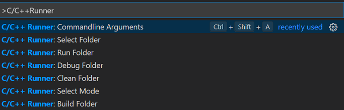
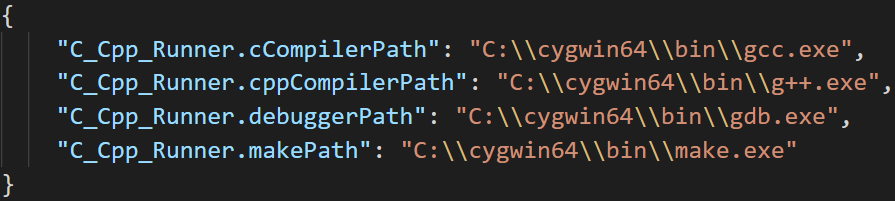
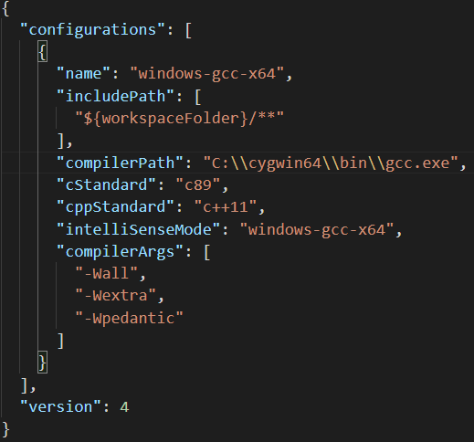
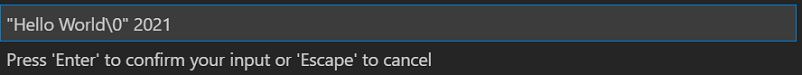
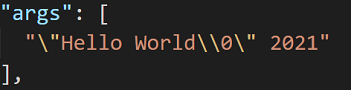
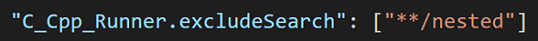
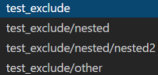
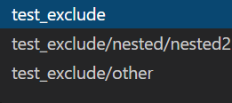

# VSCode C/C++ Runner

🚀 Compile, run and debug single or multiple C/C++ files with ease. 🚀

This extension provides tasks to compile, run and debug your C/C++ code.  
It does not only compile single C/C++ files but also multiple files.  
You do not need to know about any compiler and Makefile commands. 😎

## Example

## Software Requirements

- 🔧 Microsoft's C/C++ VSCode Extension (will be installed automatically)
- 🔧 For C code: gcc/clang, gdb/lldb and make
- 🔧 For C++ code: g++/clang++, gdb/lldb and make

## Install the Software Requirements (optional)

- 🖥️ Windows: Highly recommended to install gcc/g++, gdb and make via [Cygwin](https://www.cygwin.com/). An alternative to this is MinGW via [MSYS2](https://www.msys2.org/).
- 🖥️ Linux: Recommended to install gcc/g++, gdb and make via a package manager (e.g. `apt` for Debian derivates).
- 🖥️ MacOS: Recommended to install clang/clang++, lldb and make via [xcode-tools](https://developer.apple.com/xcode/features/). An alternative is installing the llvm toolchain with [brew](https://apple.stackexchange.com/a/362837).

## How to use

1️⃣ The first step is to select the folder that contains the C/C++ files you want to compile, run or debug.  
You can select the folder by the quick pick menu from the status bar.  
  
Besides that, you can also select a folder by right-clicking in the context menu.  
After selecting the folder, the icons for building, running, and debugging are shown.  
2️⃣ The second step is to select either debug or release mode for building the binary (debug is the default case).  
  
3️⃣ The third step is to execute the extension's tasks.  

- ⚙️ Build: This task will compile all C/C++ files in the selected folder and will link them into a binary.
- ▶️ Run*: This task will execute the built binary.
- 🐞 Debug*: This task will start a debugging session for the binary.
- 🗑️ Clean*: This helper task will delete all compiled object files (*.o).

*This task is a no-op if the build task was not executed previously.

### Alternative Usage

If you do not want to see the status bar items you can toggle the visibility with the command `crtl+alt+r`.  
Then you can use the different commands in vscode's command palette:

## Extension Features

### Configuration

The extension will automatically search for an installed compiler on your computer.  
For linux and mac it searches in */bin/* and */usr/bin/*, and on windows it searches for *cygwin*, *mingw*, and *msys2* in the PATH.  
All settings will be stored in the local workspace settings (*".vscode/settings.json"*).  
If you wish to use any other compiler or different setting, just edit the entries in the local settings file.  
  

Based on the operating system and the compiler, there will be a *c_cpp_properties.json* file created in the local *.vscode* folder.  
This file will be used by Microsoft's *C/C++* extension for intellisense. For more information refer to the official [documentation](https://code.visualstudio.com/docs/cpp/c-cpp-properties-schema-reference).  
  

### Passing Commandline Arguments

If you want to pass in command-line arguments for running or debugging the binary, you have to press the key bind `ctrl+shift+a`.  
Then a message box will appear where you can type the arguments:

These arguments will be stored in the launch.json config for debugging the binary.

### Exclude Folders for Selection

Since the drop-down menu of the folder selection can be very long in a workspace with many sub-folders you can add glob patterns to exclude from the search.

With the following glob pattern:

The folder selection would change from left to right.

For more information about glob pattern see [here](https://en.wikipedia.org/wiki/Glob_(programming)#Syntax).

### Extension Settings

- ⚙️ C Compiler path (defaults to gcc)
- ⚙️ C Standard (defaults to the compiler's default)
- ⚙️ C++ Compiler path (defaults to g++)
- ⚙️ C++ Standard (defaults to the compiler's default)
- ⚙️ Make path (defaults to make)
- ⚙️ Debugger path (defaults to gdb)
- ⚙️ To enable warnings (defaults to True)
- ⚙️ What warnings should be checked by the compiler (defaults to ['-Wall', '-Wextra', '-Wpedantic'])
- ⚙️ To treat warnings as errors (defaults to False)
- ⚙️ Additional compiler arguments (defaults to [])
- ⚙️ Additional linker arguments (defaults to []). It is expected to prefix the arguments with the appropriate flags (e.g. -l or -L)
- ⚙️ Additional include paths (defaults to []) It is **not** (!) expected to prefix the arguments with the appropriate **-I** flag
- ⚙️ Glob pattern to exclude from the folder selection (defaults to [])
- ⚙️ Experimental: Run compiler commands without Makefile (defaults to False)

## Important Notes

### Constraints on Files and Folders

- 📝 Allowed file extensions for headers: \*.h, \*.hpp, \*.hh, \*.hxx
- 📝 Allowed file extensions for sources: \*.c, \*.cpp, \*.cc, \*.cxx
- 📁 The folder selection menu will not list:
  - Folder names including '.' (e.g. *.vscode*), '\_\_' (e.g. temp folders) or 'CMake'
  - The folder named *build* since this is the auto generated folder by this extension
- 📝 Paths containing whitespaces or non-extended ASCII characters will use the extension's experimental code runner and not Makefile.
- 📝 It is forbidden to use spaces in filenames because Makefile cannot handle this properly

### CMake and Makefile Projects

This extension does not start whenever the CMake or Make extension by Microsoft is active in the current workspace folder.  
This means if there is a CMakeLists.txt or a Makefile in the workspace root directory, this extension is not active.  
This prevents an overloaded status bar with a lot of icons.  
However, the user can trigger the start-up of this extension by pressing `ctrl+alt+r`.

## Release Notes

Refer to the [CHANGELOG](CHANGELOG.md).

## License

Copyright (C) 2021 Jan Schaffranek.  
Licensed under the [MIT License](LICENSE).
