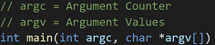

# VSCode C/C++ Runner

🚀 Compile, run and debug [**single**](#compile-a-single-file) or [**multiple**](#compile-all-files-in-one-folder) C/C++ files with ease. 🚀  
You do not need to know about any compiler commands. 😎

## Example

## Software Requirements

- 🔧 Any GCC, Clang, or MSVC compiler

Make sure that your GCC/Clang compiler is either in your [PATH](https://superuser.com/a/284351) or you have to manually set the **C/ C++ Compiler** setting of this extension.  
For Windows Users that want to use the [Visual Studio compiler](https://visualstudio.microsoft.com/) (called **MSVC**) see instructions [here](#using-the-msvc-compiler).

## The Extension automatically activates when

- There is a C/C++ file in the **root** directory of your workspace
- You open a C/C++ file in your workspace

## Compile a single file

1️⃣ Open the C/C++ file you want to compile (build).  
2️⃣ Select either debug or release mode for building the binary (debug is the default case).  
3️⃣ To build the binary press **ctrl+alt+b**.  
4️⃣ To run the binary press **ctrl+alt+r**, or you can click on the play symbol in the status bar down below.  
5️⃣ To debug the binary press **ctrl+alt+d**, or you can click on the bug symbol in the status bar down below.  

## Compile all files in one folder

1️⃣ Select the folder that contains the C/C++ files you want to compile.  
You can select the folder by the quick pick menu from the status bar.  
  
2️⃣ Select either debug or release mode for building the binary (debug is the default case).  
  
3️⃣ Now you can build/run/debug the binary.  

- ⚙️ Build: This task will compile all C/C++ files in the selected folder and will link them into a binary.  
The shortcut is: *ctrl+alt+b*
- ▶️ Run*: This task will execute the built binary.  
The shortcut is: *ctrl+alt+r*
- 🗑️ Clean*: This helper task will delete all files in the build dir.
- 🐞 Debug*: This task will start a debugging session for the binary.  
The shortcut is: *ctrl+alt+d*

*This task is a no-op if the build task was not executed previously.

## Basic Features

### Configuration

The configuration settings will be stored **locally** in *".vscode/settings.json"*.  
  

Based on that, the local *".vscode/c_cpp_properties.json"* file is created.  
It will be used by [Microsoft's *C/C++*](https://code.visualstudio.com/docs/cpp/c-cpp-properties-schema-reference) extension for intellisense (auto-completion etc.).  
Note: You **don't** have to edit this file.  

### Basic settings

- ⚙️ C Compiler Path (string, defaults to \"gcc\")
- ⚙️ C Standard (string, defaults to the compiler's default, e.g. "c99")
- ⚙️ C++ Compiler Path (string, defaults to \"g++\")
- ⚙️ C++ Standard (string, defaults to the compiler's default, e.g. "c++20")
- ⚙️ Debugger Path (string, defaults to \"gdb\")
- ⚙️ MSVC Batch Path (string, defaults to \"\")
- ⚙️ Use MSVC (boolean, defaults to false)
- ⚙️ To enable Compiler Warnings (boolean, defaults to True)
- ⚙️ GCC/Clang [Compiler Warnings](https://clang.llvm.org/docs/DiagnosticsReference.html) (string array, e.g. "-Wall")
- ⚙️ MSVC [Compiler Warnings](https://learn.microsoft.com/en-us/cpp/error-messages/compiler-warnings/compiler-warnings-by-compiler-version?view=msvc-170) (string array, e.g. "\W4")
- ⚙️ To treat Warnings as Errors (boolean, defaults to False)

## Using the MSVC Compiler

To use the **Visual Studio MSVC** compiler, e.g. VS2022, set the **msvcBatchPath** setting to a valid path.  
As an example installation path of the compiler:  
**"C:/Program Files/Microsoft Visual Studio/2022/Community/VC/Auxiliary/Build/vcvarsall.bat"**.  
Then set the **useMsvc** extension setting to true, to use MSVC and not GCC/Clang.  
If you want to stop using the MSVC compiler, just set **useMsvc** to false.  
⚠️ Only the 64-bit (no cross-compiling) version of MSVC is supported.

## Advanced Features

### Passing Commandline Arguments

You can pass in command-line arguments for running or debugging the binary.  

Make sure to select the active folder that should be compiled beforehand.  
Then press `ctrl+alt+a` to open the message box to type in the arguments:

These arguments will be stored in the launch.json config for debugging the binary.  

If you now run or debug your program these values will be fed into **argc**/**argv**.  
Important: The stored arguments will be reset after selecting a new active folder.  
Note: For strings with whitespaces please use \" (not single \').

### Include & Exclude Folders for Selection

You can add [glob](https://en.wikipedia.org/wiki/Glob_(programming)#Syntax) patterns to include and exclude folders from the folder selection.  
Note: The include pattern is used before the exclude pattern.

For example with the following exclude glob pattern:

The folder selection would change from left to right.

### Generate Assembler Code

When executing the command: "Generate Assembler Code".  
The assembler code will be generated in a **.s** file that will be in the build directory next to the executable.  
👷🏻 Currently, this feature is experimental and only works for single-file builds.  

### Advanced Settings

- **If** the compiler has it implemented and only in **debug build**
  - ⚙️ Activate the [address sanitizer](https://clang.llvm.org/docs/AddressSanitizer.html)
  - ⚙️ Activate the [undefined sanitizer](https://clang.llvm.org/docs/UndefinedBehaviorSanitizer.html)
  - ⚙️ Activate the [leak sanitizer](https://clang.llvm.org/docs/LeakSanitizer.html)
- ⚙️ Show detailed Information about the Compilation Time
- ⚙️ Use link time optimization for release builds
- ⚙️ Compiler Arguments (string array, e.g. **\[\"-pthreads\"\]**)
- ⚙️ Linker Arguments (string array, e.g. **\[\"-lpthread\"\]**).
  - Note: It is **expected** to prefix the arguments with the appropriate flags (e.g. -l or -L for Gcc/Clang)
- ⚙️ Include Paths (string array, e.g. **\[\"path/to/headers/\"\]**)
  - Note: It is **not (!) expected** to prefix the arguments with the **-I** or **/I** flag
- ⚙️ Include Glob Pattern for the Folder Selection (string array, defaults to **["\*", "\*\*/\*"]**)
- ⚙️ Exclude Glob Pattern for the Folder Selection (string array, defaults to **["\*\*/build", "\*\*/.\*", "\*\*/.vscode",]**)

## Important Notes

### Constraints with Files and Folders

- 📝 File extensions for headers: \*.h, \*.hpp, \*.hh, \*.hxx
- 📝 File extensions for sources: \*.c, \*.cpp, \*.cc, \*.cxx
- ⚠️ Include paths with whitespaces can make the compilation fail

### CMake Projects in the Workspace Directory

The extension buttons are hidden if there is a CMakeLists.txt in the workspace root directory.  
This prevents an overloaded status bar with a lot of icons due to Microsoft's CMake extension.  
However, the user can trigger the start-up of this extension by pressing `ctrl+alt+t`.

## Release Notes

Refer to the [CHANGELOG](CHANGELOG.md).

## License

Copyright (C) 2021-2023 Jan Schaffranek.  
Licensed under the [MIT License](LICENSE).

## Supporting the Work

Feel free to donate, such that I have more time to work on my VSCode extension*s*.

Or use the Link: <https://www.paypal.com/donate/?hosted_button_id=3WDK6ET99ZQCU>
