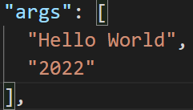
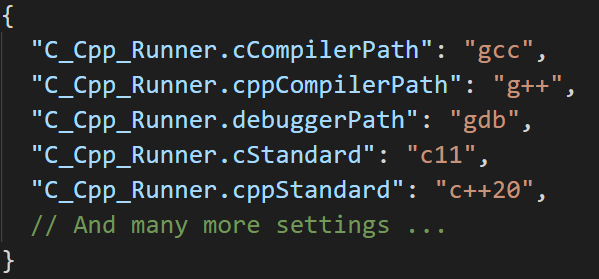

# VSCode C/C++ Runner

🚀 Compile, run and debug **single** or **multiple** C/C++ files with ease. 🚀

This extension provides an easy interface to compile, run and debug your C/C++ code.  
You do not need to know about any compiler commands. 😎

## Example

## Software Requirements

- 🔧 For C code: Any GCC, Clang or MSVC compiler
- 🔧 For C++ code: Any G++, Clang++ or MSVC compiler

## Install the Software Requirements (optional)

- 🖥️ Windows:
  - Alternative 1: Install gcc, g++ and gdb via [Cygwin](https://www.cygwin.com/) or [MSYS2](https://www.msys2.org/)  
  - Alternative 2: Install MSVC via [VS BuildTools](https://visualstudio.microsoft.com/de/downloads/?q=build+tools) - see [below](#using-the-msvc-compiler) for instructions  
- 🖥️ Linux/MacOS:
  - Recommended to install gcc, g++ and gdb via a package manager (e.g. `apt`)
- 🖥️ MacOS:
  - Alternative 1: Install clang, clang++ and lldb via [xcode-tools](https://developer.apple.com/xcode/features/)
  - Alternative 2: Install clang, clang++ and lldb with the llvm toolchain via [brew](https://apple.stackexchange.com/a/362837)

## Extension Activation Conditions

- Whenever there is a C/C++ file in the base directory of your workspace
- Whenever you open a C/C++ file

## How to use: Compile **all** files in a folder

1️⃣ Select the folder that contains the C/C++ files.  
You can select the folder by the quick pick menu from the status bar.  
  
Besides that, you can also select a folder by right-clicking in the context menu.  
2️⃣ Select either debug or release mode for building the binary (debug is the default case).  
  
3️⃣ Now you can build/run/debug the binary.  

- ⚙️ Build: This task will compile all C/C++ files in the selected folder and will link them into a binary.
- ▶️ Run*: This task will execute the built binary.
- 🗑️ Clean*: This helper task will delete all compiled object files (*.o).
- 🐞 Debug*: This task will start a debugging session for the binary.

*This task is a no-op if the build task was not executed previously.

## How to use: Compile a **single** file

1️⃣ Open the C/C++ file you want to compile (build).  
2️⃣ Select either debug or release mode for building the binary (debug is the default case).  
3️⃣ To build the binary press **ctrl+alt+b**.  
4️⃣ To run the binary press **ctrl+alt+r**.  
5️⃣ To debug the binary press **ctrl+alt+d**.  

## Extension Features

### Passing Commandline Arguments

You can pass in command-line arguments for running or debugging the binary.  
Make sure to select the active folder beforehand, then press `ctrl+shift+a` to open the message box to type in the arguments:

These arguments will be stored in the launch.json config for debugging the binary.  

If you now run or debug your program these values will be fed into **argc**/**argv**.  
The stored arguments will be reset after selecting a new active folder.  
Note: Do not use ' or " for any arguments.

### Include & Exclude Folders for Selection

You can add glob patterns to include and exclude folders from the search to shorten the list.  
Note: The include pattern is used before the exclude pattern.

For example with the following exclude glob pattern:

The folder selection would change from left to right.

For more information about glob pattern see [here](https://en.wikipedia.org/wiki/Glob_(programming)#Syntax).

### Configuration

The extension will automatically search for an installed compiler on your computer.  
For Linux and mac, it searches in */usr/bin/*, and on windows, it searches for *Cygwin*, *mingw*, and *msys2* in the PATH.  
Note: On windows, it will not be searched for any MSVC installation.  
All settings will be stored in the **local** workspace settings (*".vscode/settings.json"*).  
If you wish to use any other compiler or different setting, just edit the entries in the **local** settings file.  
  

Based on the operating system and the compiler, there will be a *c_cpp_properties.json* file created in the local *.vscode* folder.  
This file will be used by Microsoft's *C/C++* extension for intellisense. For more information refer to the official [documentation](https://code.visualstudio.com/docs/cpp/c-cpp-properties-schema-reference).  
  

### Extension Settings

- ⚙️ C Compiler path (defaults to gcc)
- ⚙️ C Standard (defaults to the compiler's default)
- ⚙️ C++ Compiler path (defaults to g++)
- ⚙️ C++ Standard (defaults to the compiler's default)
- ⚙️ Debugger path (defaults to gdb)
- ⚙️ MSVC batch path (defaults to \"\")
- ⚙️ To enable warnings (defaults to True)
- ⚙️ What warnings should be checked by the compiler (defaults to [\"-Wall\", \"-Wextra\", \"-Wpedantic\"])
- ⚙️ To treat warnings as errors (defaults to False)
- ⚙️ Additional compiler arguments (defaults to [] e.g. **-flto**)
- ⚙️ Additional linker arguments (defaults to [] e.g. **-lpthread**).
  - Note: It **is** expected to prefix the arguments with the appropriate flags (e.g. -l or -L)
- ⚙️ Additional include paths (defaults to [] e.g. **path/to/headers/**)
  - Note: It is **not** (!) expected to prefix the arguments with the **-I** flag
- ⚙️ Include glob pattern for the folder selection (defaults to ["\*", "\*\*/\*"])
- ⚙️ Exclude glob pattern for the folder selection (defaults to ["\*\*/build", "\*\*/.\*", "\*\*/.vscode",])

## Important Notes

### Constraints on Files and Folders

- 📝 Allowed file extensions for headers: \*.h, \*.hpp, \*.hh, \*.hxx
- 📝 Allowed file extensions for sources: \*.c, \*.cpp, \*.cc, \*.cxx

### CMake Projects in the Workspace Directory

This extension does not start whenever there is a CMakeLists.txt in the workspace root directory.  
This prevents an overloaded status bar with a lot of icons due to Microsoft's CMake extension.  
However, the user can trigger the start-up of this extension by pressing `ctrl+alt+t`.

## Using the MSVC Compiler

To use the MSVC compiler (toolchain), set the local **msvcBatchPath** setting.  
An example path would be **"*PathToVs2022*/Community/VC/Auxiliary/Build/vcvarsall.bat"**.  
Then the other settings about the GCC/Clang tools are ignored in the current workspace.  
If you want to stop using the MSVC compiler, just reset the local **msvcBatchPath** setting.  
Caveat: Currently no cross-compiling is allowed.

## Release Notes

Refer to the [CHANGELOG](CHANGELOG.md).

## License

Copyright (C) 2021-2022 Jan Schaffranek.  
Licensed under the [MIT License](LICENSE).
