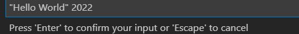

# VSCode C/C++ Runner

🚀 Compile, run and debug single or multiple C/C++ files with ease. 🚀

This extension provides an easy interface to compile, run and debug your C/C++ code.  
It does not only compile single C/C++ files but also multiple files.  
You do not need to know about any compiler commands. 😎

## Example

## Software Requirements

- 🔧 For C code: Any GCC, Clang or MSVC compiler
- 🔧 For C++ code: Any G++, Clang++ or MSVC compiler

## Install the Software Requirements (optional)

- 🖥️ Windows:
  - Alternative 1: Install gcc, g++ and gdb via [Cygwin](https://www.cygwin.com/).  
  - Alternative 2: Linux Distro via [WSL2](https://docs.microsoft.com/en-us/windows/wsl/install).
  - Alternative 3: MinGW via [MSYS2](https://www.msys2.org/).  
  - Alternative 4: MSVC Compiler via [VS/BuildTools](https://visualstudio.microsoft.com/de/downloads/?q=build+tools) - see [below](#using-the-msvc-compiler) for instructions.  
- 🖥️ Linux:
  - Recommended to install gcc, g++ and gdb via a package manager (e.g. `apt`).
- 🖥️ MacOS:
  - Alternative 1: Install clang, clang++ and lldb via [xcode-tools](https://developer.apple.com/xcode/features/).
  - Alternative 2: Install the llvm toolchain with [brew](https://apple.stackexchange.com/a/362837).

## How to use: Compile **all** files in a folder

1️⃣ Select the folder that contains the C/C++ files.  
You can select the folder by the quick pick menu from the status bar.  
  
Besides that, you can also select a folder by right-clicking in the context menu.  
2️⃣ Select either debug or release mode for building the binary (debug is the default case).  
  
3️⃣ Now you can build/run/debug the binary.  

- ⚙️ Build: This task will compile all C/C++ files in the selected folder and will link them into a binary.
- ▶️ Run*: This task will execute the built binary.
- 🐞 Debug*: This task will start a debugging session for the binary.
- 🗑️ Clean*: This helper task will delete all compiled object files (*.o).

*This task is a no-op if the build task was not executed previously.

## How to use: Compile a single file

1️⃣ Open the C/C++ file you want to compile (build).  
2️⃣ Select either debug or release mode for building the binary (debug is the default case).  
3️⃣ To build the binary press **ctrl+alt+b**.  
4️⃣ To run the binary press **ctrl+alt+r**.  
5️⃣ To debug the binary press **ctrl+alt+d**.  

## Extension Features

### Configuration

The extension will automatically search for an installed compiler on your computer.  
For Linux and mac, it searches in */usr/bin/*, and on windows, it searches for *Cygwin*, *mingw*, and *msys2* in the PATH.  
Note: On windows, it will not be searched for any MSVC installation.  
All settings will be stored in the local workspace settings (*".vscode/settings.json"*).  
If you wish to use any other compiler or different setting, just edit the entries in the local settings file.  
  

Based on the operating system and the compiler, there will be a *c_cpp_properties.json* file created in the local *.vscode* folder.  
This file will be used by Microsoft's *C/C++* extension for intellisense. For more information refer to the official [documentation](https://code.visualstudio.com/docs/cpp/c-cpp-properties-schema-reference).  
  

### Passing Commandline Arguments

You can pass in command-line arguments for running or debugging the binary.  
Make sure to select the active folder beforehand, then press `ctrl+shift+a` to open the message box to type in the arguments:

These arguments will be stored in the launch.json config for debugging the binary.  

The stored arguments will be reset after selecting a new active folder.

### Include & Exclude Folders for Selection

You can add glob patterns to include and exclude folders from the search to shorten the list.  
Note: The include pattern is used before the exclude pattern.

For example with the following exclude glob pattern:

The folder selection would change from left to right.

For more information about glob pattern see [here](https://en.wikipedia.org/wiki/Glob_(programming)#Syntax).

### Extension Settings

- ⚙️ C Compiler path (defaults to gcc)
- ⚙️ C Standard (defaults to the compiler's default)
- ⚙️ C++ Compiler path (defaults to g++)
- ⚙️ C++ Standard (defaults to the compiler's default)
- ⚙️ Debugger path (defaults to gdb)
- ⚙️ MSVC batch (toolchain) path (defaults to '')
- ⚙️ To enable warnings (defaults to True)
- ⚙️ What warnings should be checked by the compiler (defaults to ['-Wall', '-Wextra', '-Wpedantic'])
- ⚙️ To treat warnings as errors (defaults to False)
- ⚙️ Additional compiler arguments (defaults to [] e.g. **-flto**)
- ⚙️ Additional linker arguments (defaults to [] e.g. **-lpthread**).
  - Note: It **is** expected to prefix the arguments with the appropriate flags (e.g. -l or -L)
- ⚙️ Additional include paths (defaults to [] e.g. **path/to/headers/**)
  - Note: It is **not** (!) expected to prefix the arguments with the **-I** flag
- ⚙️ Include glob pattern for the folder selection (defaults to ["\*", "\*\*/\*"])
- ⚙️ Exclude glob pattern for the folder selection (defaults to ["\*\*/build", "\*\*/.\*", "\*\*/.vscode",])

## Important Notes

### Constraints on Files and Folders

- 📝 Allowed file extensions for headers: \*.h, \*.hpp, \*.hh, \*.hxx
- 📝 Allowed file extensions for sources: \*.c, \*.cpp, \*.cc, \*.cxx
- 📁 The folder selection menu will not list:
  - Folder names **including** '.' (e.g. *.vscode*), '\_\_' (e.g. temp folders) or 'CMake'
  - The folder named *build* since this is the auto generated folder by this extension

### CMake Projects in the Workspace Directory

This extension does not start whenever there is a CMakeLists.txt in the workspace root directory.  
This prevents an overloaded status bar with a lot of icons due to Microsoft's CMake extension.  
However, the user can trigger the start-up of this extension by pressing `ctrl+alt+t`.

## Using the MSVC Compiler

Since version 3.0 the MSVC compiler (toolchain) can also be used.  
To do so, set the setting **msvcBatchPath** to a valid path.  
Then the other settings about the compiler and debugger are ignored in the workspace.  
Note: The batch file will be started with the system's architecture.  
E.g. on a 64bit Windows, here only the 64bit (Host and Target) compiler will be used - so no cross-compiling.  
Caveat 1: Currently if warnings are enabled, only **/W3** is used.  
Caveat 2: Currently the linker args are ignored.  

## Release Notes

Refer to the [CHANGELOG](CHANGELOG.md).

## License

Copyright (C) 2021 Jan Schaffranek.  
Licensed under the [MIT License](LICENSE).
